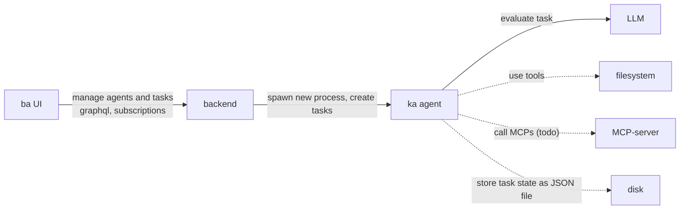
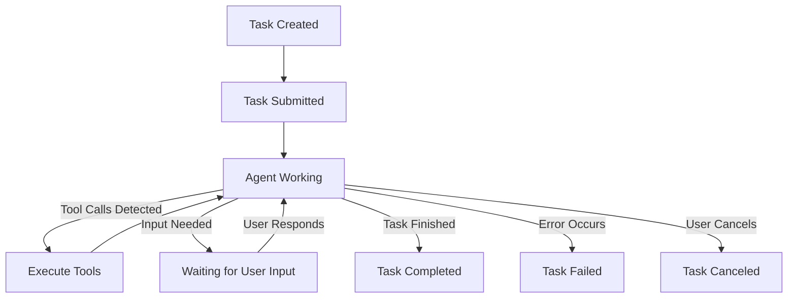
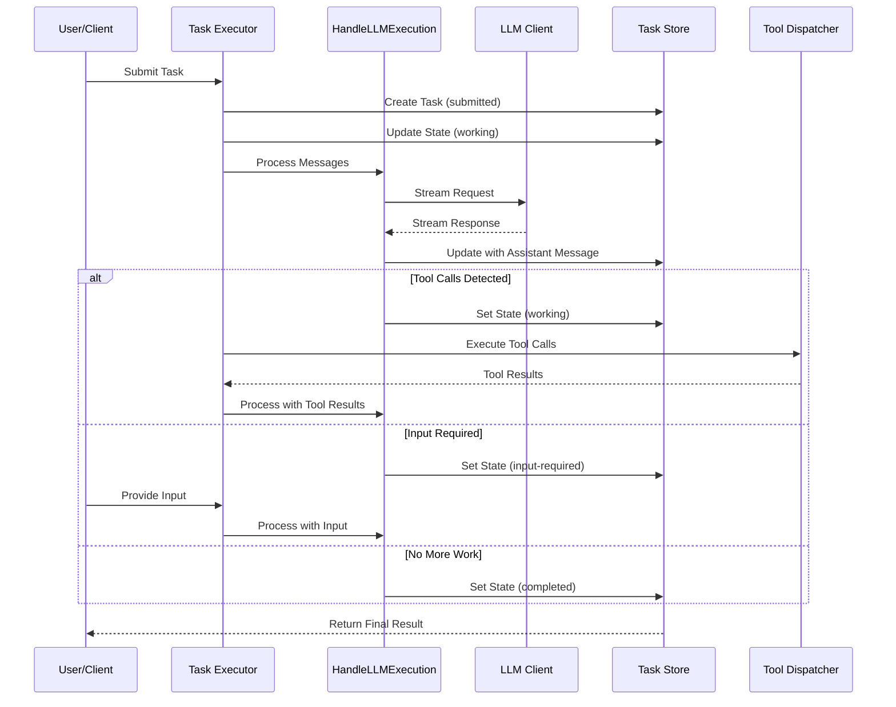
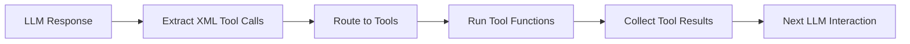

# 🙌🏻 ka_ba 🦚

AI Agent Runtime (`ka`) and agent orchestration application (`ba`).


## Naming
> *ka* (𓂓) and *ba* (𓅽) - is the ancient Egyptian concept of the soul layers.
> The "vital essence" and the "personality".
> 
> kaaba - "House of God"
> 
> baka (jap. バカ) - "fool"


## Goals and vision
- Agent runtime
    - ☑️ Tools
    - Modular
    - MCP 
    - Loop prevention
    - Ratelimiting (max RPM to LLM)
    - Max task processing
- Multiagent orchestration of tasks with multiple agents
    - Agent-to-Agent calls
    - Automatic discovery (DNS/k8s)
    - Sequential / parallel workflows
- Custom LLM per agent with ratelimiting
- Multitasking
    - ☑️ task duplication
    - automatic task creation from other tasks
- Permanent thinking agent
    - Sentry mode (security, code style, refactoring, marketing)
    - Watching filesystem
- Security:
    - limit agent access to specfic folders only
    - add dockerization support
    - detect unsafe commands
- I/O
    - push notifications
    - multimodal inputs
    - audio notes agent use-case
- Composeable chat UI (place multiple agents into single chat on custom website and let them interact with each other)

## Architecture

Kaba is a project combining two main components:

1.  **`ka`**: (Located in `ka/`) A Go-based AI agent runtime compatible with the Agent-to-Agent (A2A) communication protocol. It provides a CLI and an HTTP server for task management.
2.  **`ba`**: (Located in `src/`) A web-based UI (Vite/React) acting as a control layer for A2A agents, including `ka`.
3.  **`backend`**: (Located in `backend/`) A potential backend service for `ba`, intended for spawning local `ka` instances.





## `ba` - A2A Agent UI, Control, and Orchestration Layer (`src/`)

`ba` is a web application built with Vite and React (located in the `src/` directory), designed to serve as a user interface, control panel, and orchestration layer for Agent-to-Agent (A2A) compliant AI agents. It aims to provide a unified interface for interacting with various agents, including the local [`ka`](#ka---ai-agent-runtime-ka) agent runtime.


## Purpose

The primary goal of `ba` is to enable users to:

*   Manage and interact with A2A-compliant AI agents.
*   Spawn and control local instances of the `ka` agent.
*   Submit tasks to selected agents with various input types.
*   Monitor task status and view results, including streaming output and artifacts.
*   Eventually, orchestrate complex workflows involving multiple agents.

## `ba` Features

`ba` is being developed to include the following features (see [TODO.md](TODO.md) for detailed tasks and progress):

*   **Agent Management:** Add, remove, and list A2A agent endpoints.
*   **Local `ka` Control:** Spawn and stop local `ka` agent processes with configurable settings.
*   **Task Interaction:** Send tasks to selected agents, handle different input types (text, files, data), and receive/display streaming responses and final results.
*   **Task Monitoring:** View the status and history of tasks.
*   **Artifact Handling:** Retrieve and display artifacts generated by agents.
*   **Input Handling:** Provide necessary input to agents when a task requires it.
*   **Orchestration:** (Planned) Define and execute workflows involving multiple agents.
*   **Agent Discovery:** (Planned) Fetch and display agent capabilities from their Agent Cards (`/.well-known/agent.json`).

## A2A Agent Requirements

For effective interaction and future orchestration capabilities within `ba`, A2A-compliant agents are expected to implement the following standard endpoint:

*   **`/agents/update` (POST):** This endpoint, as defined in the A2A specification, allows `ba` (or other control layers) to inform an agent about the presence and details of other agents in the network. Implementing this is crucial for enabling features like agent-to-agent task delegation and collaborative workflows managed by `ba`.

## Getting Started

### Prerequisites

*   Node.js and npm/yarn/pnpm
*   Go (if you plan to spawn local `ka` agents)
*   An A2A-compliant agent running and accessible via a URL (e.g., a running `ka` instance).

### `ba` Setup

*Note: These commands should typically be run from the project root (`kaba/`).*

1.  Install frontend dependencies:
    ```bash
    npm install # or yarn install or pnpm install
    ```
2.  **Backend Setup (Pending):** The dedicated backend for `ba` (in `backend/`), intended for spawning local `ka` processes, is not yet implemented. Functionality requiring the backend (like spawning `ka` from the UI) will not be available until it's built.

### Running `ba`

1.  Start the `ba` frontend development server (from the project root):
    ```bash
    npm run dev # or yarn dev or pnpm dev
    ```
    The application should now be running at `http://localhost:5173` (or another port if 5173 is in use).
2.  Ensure your target A2A agent(s) (e.g., a running `ka` instance) are accessible from your browser or via a proxy if needed.

## `ba` Project Structure

*   `src/`: Frontend source code (React/TypeScript).
*   `backend/`: Placeholder for the pending backend service.
*   `vite.config.ts`, `package.json`, etc. in the root directory configure the frontend build.


## `ka` - AI Agent Runtime (`ka/`)

Located in the `ka/` directory, this project implements a Go-based agent runtime compatible with the Agent-to-Agent (A2A) communication protocol. It provides both a command-line interface (`ka`) for direct interaction with a configured LLM and an HTTP server exposing A2A-compliant endpoints for task management.

The primary goal is to create a flexible and extensible runtime that can manage tasks, interact with LLMs (initially via LM Studio's OpenAI-compatible API), and potentially integrate with other tools and capabilities.


## `ka` Features

*   **A2A HTTP Server:**
    *   Serves agent self-description at `/.well-known/agent.json`.
    *   Implements core A2A task endpoints:
        *   `/tasks/send`: Accepts tasks for asynchronous processing.
        *   `/tasks/sendSubscribe`: Accepts tasks and streams responses via Server-Sent Events (SSE).
        *   `/tasks/status`: Retrieves the status and details of a task.
        *   `/tasks/input`: Allows providing input to tasks waiting in the `input-required` state.
        *   `/tasks/artifact`: Retrieves artifacts generated by tasks.
        *   `/tasks/pushNotification/set`: Placeholder for push notification registration.
    *   Supports different input `Part` types (`TextPart`, `FilePart`, `DataPart`) for task submission.
        *   Basic handling for `file://` URIs in `FilePart` is included.
    *   Handles `input-required` state transitions based on LLM response markers.
*   **Task Management:**
    *   Defines a `Task` model with states (`submitted`, `working`, `input-required`, `completed`, `failed`, `canceled`).
    *   Includes both an `InMemoryTaskStore` (default, non-persistent) and a `FileTaskStore` (persistent, saves tasks as JSON files in `_tasks/`).
*   **`ka` Command-Line Tool:**
    *   Provides direct interaction with the configured LLM (requires LM Studio running).
    *   Supports piping input (`cat file | ka`).
    *   Supports streaming responses (`ka --stream "prompt"`).
    *   Can output the agent's self-description (`ka --describe`).
*   **LLM Integration:**
    *   Connects to OpenAI-compatible APIs (tested with LM Studio).
    *   Configurable via environment variables (see `llm/llm.go`).
    *   Supports streaming responses from the LLM.

## `ka` Getting Started

### `ka` Prerequisites

*   Go (version 1.22 or later recommended)
*   [LM Studio](https://lmstudio.ai/) installed and running (`lms server start`) or another OpenAI-compatible API endpoint accessible for LLM interaction.

### Building & testing `ka`

*Note: These commands should be run from the `ka/` directory.*

```bash
cd ka
make build
make test
```

### Running the `ka` A2A Server

*Note: Run these commands from the project root (`kaba/`).*

Start the server (uses in-memory task storage by default):
```bash
./ka server
# Or simply:
# ./ka
```
The server defaults to port 8080.

To use persistent file-based task storage:
```bash
./ka server --task-store file --task-store-path ./_ka_tasks
```
(This will create and use the `_ka_tasks` directory in the project root).

The server exposes standard A2A endpoints:
*   `http://localhost:8080/.well-known/agent.json`
*   `http://localhost:8080/tasks/send` (POST)
*   `http://localhost:8080/tasks/sendSubscribe` (POST)
*   `http://localhost:8080/tasks/status?id={task_id}` (GET)
*   `http://localhost:8080/tasks/input` (POST)
*   `http://localhost:8080/tasks/artifact?id={task_id}&artifact_id={artifact_id}` (GET)
*   ... and others as defined in the A2A specification.

### Using the `ka` CLI Tool

*Note: Run these commands from the project root (`kaba/`). Ensure the `ka` executable exists there.*

**Basic Interaction:**
```bash
./ka "Hello, world!"
```

**Streaming:**
```bash
./ka --stream "Tell me a story."
```

**Piping Input:**
```bash
cat README.md | ./ka ai "Summarize this file."
```

**Agent Description (from server):**
```bash
./ka describe
```

**Maximum Context Length:**
```bash
./ka --max_context_length 4096 "Prompt requiring specific context length"
```

## `ka` Configuration (Environment Variables)

The `ka` agent (both server and CLI) uses environment variables for configuration, primarily for connecting to the LLM:

*   `LLM_API_BASE`: (Required) The base URL of the OpenAI-compatible API (e.g., `http://localhost:1234/v1` for LM Studio).
*   `LLM_API_KEY`: The API key for the LLM service (often optional for local models like LM Studio, e.g., `lm-studio`).
*   `LLM_MODEL`: The model identifier to use (e.g., `local-model`). If not set, `ka` might use a default or the first available model.
*   `KA_SERVER_PORT`: Port for the A2A HTTP server (defaults to `8080`).
*   `KA_TASK_STORE`: Type of task store (`memory` or `file`, defaults to `memory`).
*   `KA_TASK_STORE_PATH`: Path for the file task store (defaults to `_tasks/` relative to where `ka` is run).

Example `.env` file (place in `kaba/` and source it or use a tool like `direnv`):
```dotenv
LLM_API_BASE="http://localhost:1234/v1"
LLM_API_KEY="lm-studio"
LLM_MODEL="local-model"
KA_SERVER_PORT="8081"
KA_TASK_STORE="file"
KA_TASK_STORE_PATH="./_ka_tasks"
```

## `ka` Development (`ka/` directory)

*   **Code Structure:**
    *   `main.go`: Entrypoint for CLI commands (`ai`, `server`, `describe`) and server startup.
    *   `http.go`: A2A HTTP server setup, routing, and agent card definition.
    *   `ai.go`: Implementation of the `ka ai` CLI command logic.
    *   `a2a/`: Package containing A2A protocol types (Task, Message, Part, Artifact), TaskStore interface/implementations, and HTTP handlers.
    *   `llm/`: Package for LLM client abstraction and interaction.

## `ka` Agent Workflow

The `ka` agent implements a sophisticated workflow for handling tasks and LLM interactions. Below is a detailed explanation of how tasks are processed, with a focus on the LLM execution flow.

### Task Lifecycle



Tasks in `ka` follow a state machine pattern:
1. **submitted**: Initial state when a task is created
2. **working**: The agent is actively processing the task
3. **input-required**: The agent needs additional input from the user
4. **completed**: The task has been successfully completed
5. **failed**: An error occurred during task processing
6. **canceled**: The task was canceled by the user or system

### LLM Execution Flow



### `HandleLLMExecution` Function

The `HandleLLMExecution` function in `ka/a2a/executor_llm.go` is a core component that:

1. **Streams LLM Responses**: Always uses streaming for real-time updates
2. **Manages Task State**: Updates task state based on LLM response
3. **Parses Tool Calls**: Extracts XML-formatted tool calls from LLM responses
4. **Handles Errors**: Manages error conditions and state transitions

Key processing steps:
1. Sets up a buffer and signaller to detect the first write from the LLM
2. Calls the LLM with streaming enabled
3. Processes the full response, extracting any tool calls in XML format
4. Updates the task with the assistant's message
5. Determines the next state based on:
   - Presence of tool calls (→ working)
   - Need for user input (→ input-required)
   - Completion with no further actions (→ completed)

### Tool Execution Cycle



When the LLM generates tool calls in XML format:
1. The response is parsed to extract structured tool calls
2. The `ToolDispatcher` handles routing to the appropriate tools
3. Tool results are added to the conversation context
4. The task remains in the "working" state for another LLM iteration
5. This cycle continues until the LLM produces a final response with no tool calls
