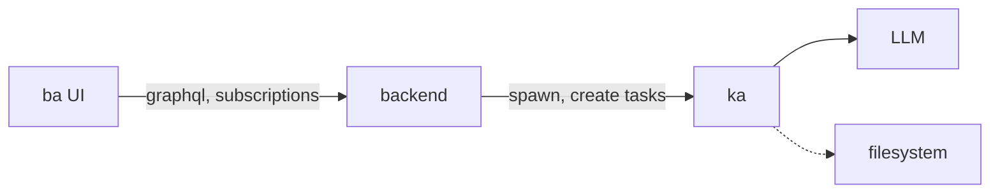

# 🙌🏻 ka_ba 🦚

AI Agent Runtime (`ka`) and UI (`ba`).

Status: `early prototype`

## Architecture

Kaba is a project combining two main components:

1.  **`ka`**: (Located in `ka/`) A Go-based AI agent runtime compatible with the Agent-to-Agent (A2A) communication protocol. It provides a CLI and an HTTP server for task management.
2.  **`ba`**: (Located in `src/`) A web-based UI (Vite/React) acting as a control layer for A2A agents, including `ka`.
3.  **`backend`**: (Located in `backend/`) A potential backend service for `ba`, intended for spawning local `ka` instances.





## `ba` - A2A Agent UI, Control, and Orchestration Layer (`src/`)

`ba` is a web application built with Vite and React (located in the `src/` directory), designed to serve as a user interface, control panel, and orchestration layer for Agent-to-Agent (A2A) compliant AI agents. It aims to provide a unified interface for interacting with various agents, including the local [`ka`](#ka---ai-agent-runtime-ka) agent runtime.


## Purpose

The primary goal of `ba` is to enable users to:

*   Manage and interact with A2A-compliant AI agents.
*   Spawn and control local instances of the `ka` agent.
*   Submit tasks to selected agents with various input types.
*   Monitor task status and view results, including streaming output and artifacts.
*   Eventually, orchestrate complex workflows involving multiple agents.

## `ba` Features

`ba` is being developed to include the following features (see [TODO.md](TODO.md) for detailed tasks and progress):

*   **Agent Management:** Add, remove, and list A2A agent endpoints.
*   **Local `ka` Control:** Spawn and stop local `ka` agent processes with configurable settings.
*   **Task Interaction:** Send tasks to selected agents, handle different input types (text, files, data), and receive/display streaming responses and final results.
*   **Task Monitoring:** View the status and history of tasks.
*   **Artifact Handling:** Retrieve and display artifacts generated by agents.
*   **Input Handling:** Provide necessary input to agents when a task requires it.
*   **Orchestration:** (Planned) Define and execute workflows involving multiple agents.
*   **Agent Discovery:** (Planned) Fetch and display agent capabilities from their Agent Cards (`/.well-known/agent.json`).

## A2A Agent Requirements

For effective interaction and future orchestration capabilities within `ba`, A2A-compliant agents are expected to implement the following standard endpoint:

*   **`/agents/update` (POST):** This endpoint, as defined in the A2A specification, allows `ba` (or other control layers) to inform an agent about the presence and details of other agents in the network. Implementing this is crucial for enabling features like agent-to-agent task delegation and collaborative workflows managed by `ba`.

## Getting Started

### Prerequisites

*   Node.js and npm/yarn/pnpm
*   Go (if you plan to spawn local `ka` agents)
*   An A2A-compliant agent running and accessible via a URL (e.g., a running `ka` instance).

### `ba` Setup

*Note: These commands should typically be run from the project root (`kaba/`).*

1.  Install frontend dependencies:
    ```bash
    npm install # or yarn install or pnpm install
    ```
2.  **Backend Setup (Pending):** The dedicated backend for `ba` (in `backend/`), intended for spawning local `ka` processes, is not yet implemented. Functionality requiring the backend (like spawning `ka` from the UI) will not be available until it's built.

### Running `ba`

1.  Start the `ba` frontend development server (from the project root):
    ```bash
    npm run dev # or yarn dev or pnpm dev
    ```
    The application should now be running at `http://localhost:5173` (or another port if 5173 is in use).
2.  Ensure your target A2A agent(s) (e.g., a running `ka` instance) are accessible from your browser or via a proxy if needed.

## `ba` Project Structure

*   `src/`: Frontend source code (React/TypeScript).
*   `backend/`: Placeholder for the pending backend service.
*   `vite.config.ts`, `package.json`, etc. in the root directory configure the frontend build.


## `ka` - AI Agent Runtime (`ka/`)

Located in the `ka/` directory, this project implements a Go-based agent runtime compatible with the Agent-to-Agent (A2A) communication protocol. It provides both a command-line interface (`ka`) for direct interaction with a configured LLM and an HTTP server exposing A2A-compliant endpoints for task management.

The primary goal is to create a flexible and extensible runtime that can manage tasks, interact with LLMs (initially via LM Studio's OpenAI-compatible API), and potentially integrate with other tools and capabilities.


## `ka` Features

*   **A2A HTTP Server:**
    *   Serves agent self-description at `/.well-known/agent.json`.
    *   Implements core A2A task endpoints:
        *   `/tasks/send`: Accepts tasks for asynchronous processing.
        *   `/tasks/sendSubscribe`: Accepts tasks and streams responses via Server-Sent Events (SSE).
        *   `/tasks/status`: Retrieves the status and details of a task.
        *   `/tasks/input`: Allows providing input to tasks waiting in the `input-required` state.
        *   `/tasks/artifact`: Retrieves artifacts generated by tasks.
        *   `/tasks/pushNotification/set`: Placeholder for push notification registration.
    *   Supports different input `Part` types (`TextPart`, `FilePart`, `DataPart`) for task submission.
        *   Basic handling for `file://` URIs in `FilePart` is included.
    *   Handles `input-required` state transitions based on LLM response markers.
*   **Task Management:**
    *   Defines a `Task` model with states (`submitted`, `working`, `input-required`, `completed`, `failed`, `canceled`).
    *   Includes both an `InMemoryTaskStore` (default, non-persistent) and a `FileTaskStore` (persistent, saves tasks as JSON files in `_tasks/`).
*   **`ka` Command-Line Tool:**
    *   Provides direct interaction with the configured LLM (requires LM Studio running).
    *   Supports piping input (`cat file | ka`).
    *   Supports streaming responses (`ka --stream "prompt"`).
    *   Can output the agent's self-description (`ka --describe`).
*   **LLM Integration:**
    *   Connects to OpenAI-compatible APIs (tested with LM Studio).
    *   Configurable via environment variables (see `llm/llm.go`).
    *   Supports streaming responses from the LLM.

## `ka` Getting Started

### `ka` Prerequisites

*   Go (version 1.22 or later recommended)
*   [LM Studio](https://lmstudio.ai/) installed and running (`lms server start`) or another OpenAI-compatible API endpoint accessible for LLM interaction.

### Building `ka`

*Note: These commands should be run from the `ka/` directory.*

1.  Navigate to the `ka` directory:
    ```bash
    cd ka
    ```
2.  Build the executable:
    ```bash
    make build
    # Or directly:
    # go build -o ../ka .
    ```
    This creates the `ka` executable in the project root (`kaba/`).

### Running the `ka` A2A Server

*Note: Run these commands from the project root (`kaba/`).*

Start the server (uses in-memory task storage by default):
```bash
./ka server
# Or simply:
# ./ka
```
The server defaults to port 8080.

To use persistent file-based task storage:
```bash
./ka server --task-store file --task-store-path ./_ka_tasks
```
(This will create and use the `_ka_tasks` directory in the project root).

The server exposes standard A2A endpoints:
*   `http://localhost:8080/.well-known/agent.json`
*   `http://localhost:8080/tasks/send` (POST)
*   `http://localhost:8080/tasks/sendSubscribe` (POST)
*   `http://localhost:8080/tasks/status?id={task_id}` (GET)
*   `http://localhost:8080/tasks/input` (POST)
*   `http://localhost:8080/tasks/artifact?id={task_id}&artifact_id={artifact_id}` (GET)
*   ... and others as defined in the A2A specification.

### Using the `ka` CLI Tool

*Note: Run these commands from the project root (`kaba/`). Ensure the `ka` executable exists there.*

**Basic Interaction:**
```bash
./ka ai "Hello, world!"
```

**Streaming:**
```bash
./ka ai --stream "Tell me a story."
```

**Piping Input:**
```bash
cat README.md | ./ka ai "Summarize this file."
```

**Agent Description (from server):**
```bash
./ka describe
```

**Maximum Context Length:**
```bash
./ka ai --max_context_length 4096 "Prompt requiring specific context length"
```

## `ka` Configuration (Environment Variables)

The `ka` agent (both server and CLI) uses environment variables for configuration, primarily for connecting to the LLM:

*   `LLM_API_BASE`: (Required) The base URL of the OpenAI-compatible API (e.g., `http://localhost:1234/v1` for LM Studio).
*   `LLM_API_KEY`: The API key for the LLM service (often optional for local models like LM Studio, e.g., `lm-studio`).
*   `LLM_MODEL`: The model identifier to use (e.g., `local-model`). If not set, `ka` might use a default or the first available model.
*   `KA_SERVER_PORT`: Port for the A2A HTTP server (defaults to `8080`).
*   `KA_TASK_STORE`: Type of task store (`memory` or `file`, defaults to `memory`).
*   `KA_TASK_STORE_PATH`: Path for the file task store (defaults to `_tasks/` relative to where `ka` is run).

Example `.env` file (place in `kaba/` and source it or use a tool like `direnv`):
```dotenv
LLM_API_BASE="http://localhost:1234/v1"
LLM_API_KEY="lm-studio"
LLM_MODEL="local-model"
KA_SERVER_PORT="8081"
KA_TASK_STORE="file"
KA_TASK_STORE_PATH="./_ka_tasks"
```

## `ka` Development (`ka/` directory)

*   **Code Structure:**
    *   `main.go`: Entrypoint for CLI commands (`ai`, `server`, `describe`) and server startup.
    *   `http.go`: A2A HTTP server setup, routing, and agent card definition.
    *   `ai.go`: Implementation of the `ka ai` CLI command logic.
    *   `a2a/`: Package containing A2A protocol types (Task, Message, Part, Artifact), TaskStore interface/implementations, and HTTP handlers.
    *   `llm/`: Package for LLM client abstraction and interaction.
*   **Building:** Navigate to `ka/` and run `make build` (outputs to `kaba/ka`).
*   **Testing:** Navigate to `ka/` and run `make test` (or `go test ./...`).
*   **TODO:** See the main project [TODO.md](../TODO.md) for the current implementation status and planned features for `ka`.

## Future Work

*   Implement task resumption logic for `input-required` state.
*   Full implementation of push notifications.
*   Support for more `Part` types and URI schemes (e.g., `http://`, `data://`).
*   Integration with MCP tools.
*   More robust error handling and input validation.
*   Comprehensive unit and integration tests.
*   Containerization improvements (health checks, etc.).

## Naming
> *ka* (𓂓) - is the ancient Egyptian concept of the soul manifestation, the "vital essence".
> *ba* (𓅽) - is the ancient Egyptian concept of the soul manifestation, the "personality".

